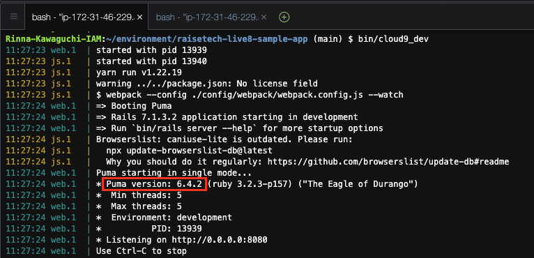
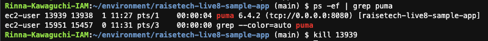
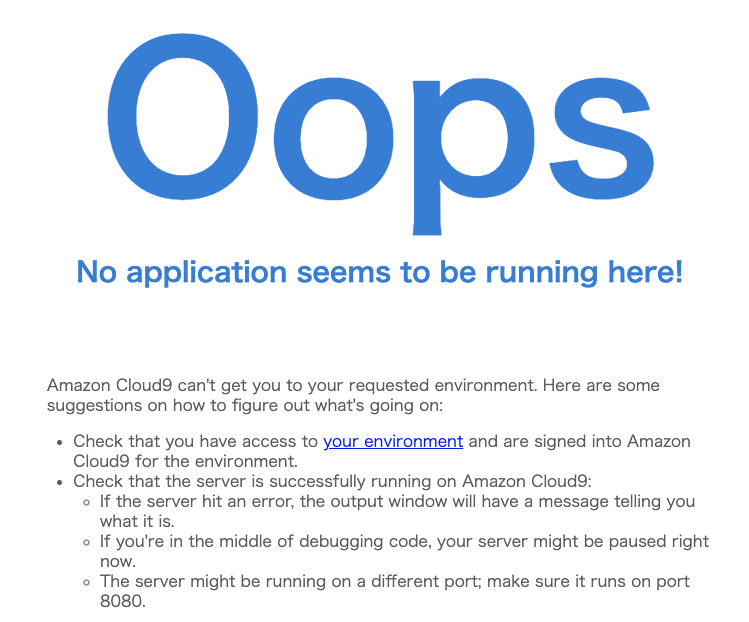
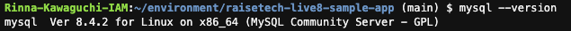
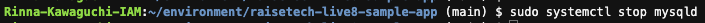
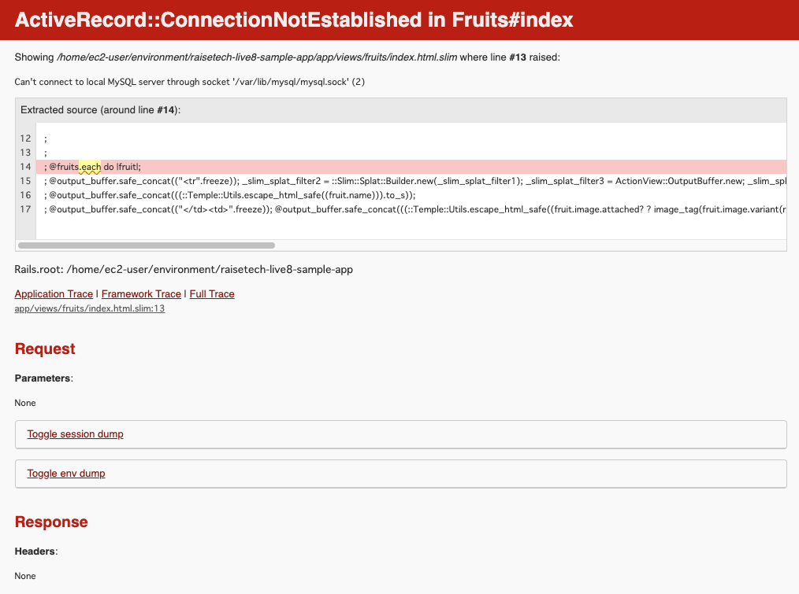

## 第 3 回課題提出

### 1.AP サーバーについて調べる

#### AP サーバーの名前とバージョン確認

- AP サーバの名前: Puma
- バージョン: 6.4.2

  

#### AP サーバーを終了させた場合、引き続きアクセスできるか？

→AP サーバを停止するとアクセスできない

### 2.DB サーバーについて調べる

#### サンプルアプリケーションで使った DB サーバー（DB エンジン）の名前と、今 Cloud9 で動作しているバージョンの確認

- DB サーバーの名前: MySQL
- バージョン: 8.4.2

  

#### DB サーバーを終了させた場合、引き続きアクセスできるか？

→DB サーバーを停止させるとアクセスできない

#### Rails の構成管理ツールの名前は何か

→bundler

### 3.今回の課題から学んだこと、感じたこと

- Puma は Rails に組み込まれている
- Puma の起動・停止方法
  - 今回のアプリでは rails server(rails s)コマンドによって Puma を起動している
  - Puma の起動方法は他にもいくつかあるらしい。Puma コマンド、pumactl コマンド、systemd 経由での起動
- MySQL の起動・停止方法
  - 停止コマンド `sudo systemctl stop mysqld`
  - 起動コマンド`sudo systemctl start mysqld`
- Ruby の Bundler では、`bundle install`を実行すると Gemfile に記載されたパッケージ(バージョン含む)をインストールし、依存関係も解決してくれる
- Java コースでもやったが、改めて Web アプリケーションの概要を学ぶことができた。今までアプリケーションサーバーをあまり意識することがなかったので、今回自分で起動・停止をやってみることができて良かった。
- 画像も表示できるようにしたかったが、vips 周りのインストールが厳しそうだったので今回は断念…今後できるようになりたい。
