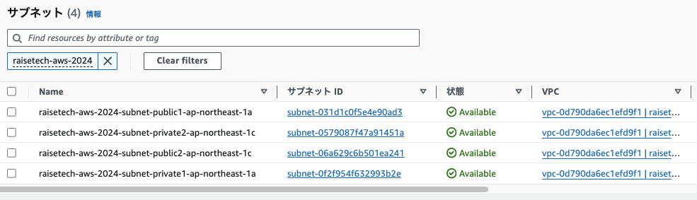
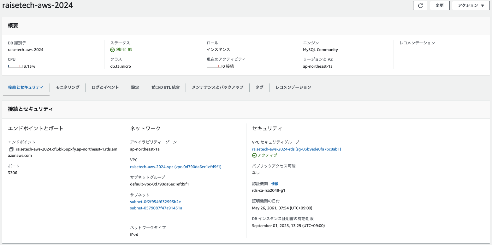
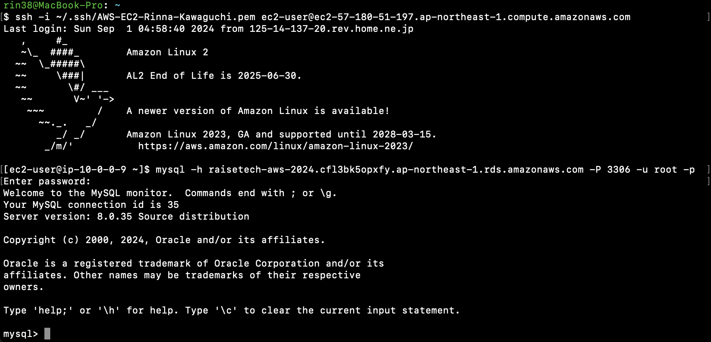

## 第 4 回課題提出

### VPC の作成

- 作成した VPC の情報
  

- VPC 内のサブネットのサブネット ID
  

### EC2 の作成

- 作成した EC2 の情報
  

- EC2 のセキュリティグループ情報

  - インバウンドルールは自分の IP アドレスからの SSH 接続のみ許可

  

### RDS の作成

- 作成した RDS の情報
  

- RDS のセキュリティーグループ情報

  - インバウンドルールは EC2 に設定したセキュリティグループからの接続のみ許可

  
  

### EC ２から RDS への接続

