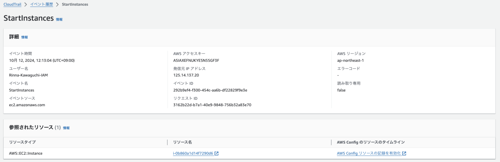
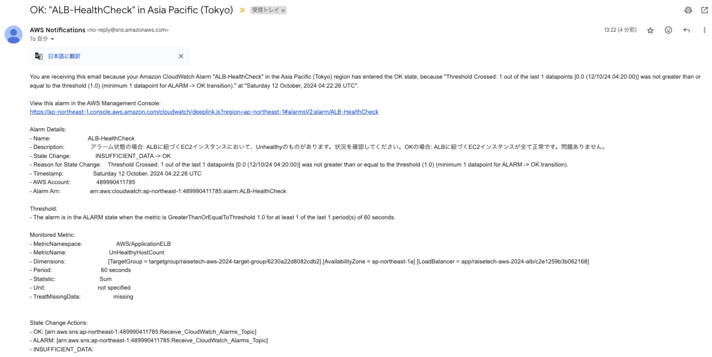
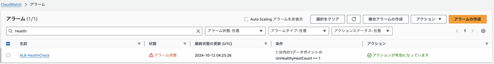
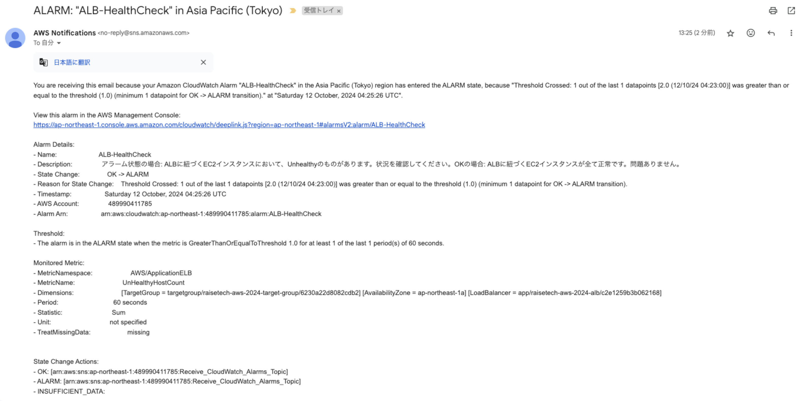
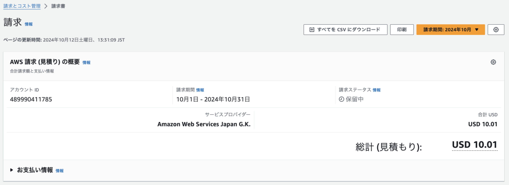
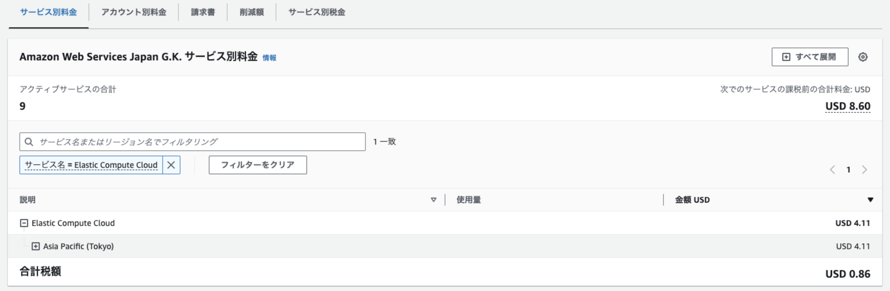

## 第 6 回課題提出

### CloudTrail イベント履歴サンプル

- イベント名: StartInstances
- 含まれている内容（3 つ）: イベント時間、ユーザー名、イベントソース

### CloudWatch アラーム

#### Rails アプリケーションが使える状態の時

アラームが OK 状態となり OK のメールが送付される。

#### Rails アプリケーションが使えない状態の時

アラーム状態となりアラームメールが送付される

### AWS 利用料

#### 今日までに作成したリソースの見積もり

https://calculator.aws/#/estimate?id=7649169ffac619b70a4bfed4416fdd2654bda0e7

#### 現在の利用料

USD 10.01

#### 先月の EC2 利用料

USD 4.11  
無料利用枠は使用開始から 12 ヶ月を過ぎているため対象外

