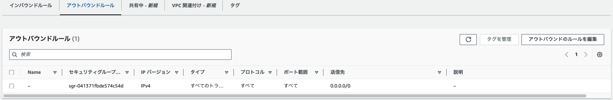

## 第 10 回課題

これまでに作った[環境](https://github.com/rinna-kawaguchi/RaiseTech-AWS/blob/main/lecture05/lecture05.md#%E6%A7%8B%E6%88%90%E5%9B%B3)を CloudFormation でコード化して自動作成。

### テンプレート

- ネットワーク関連(VPC): [network_template](template/cfn_network.yaml)
- IAM ロール: [role_template](template/cfn_iam_role.yaml)
- アプリケーション関連(EC2, RDS, ALB, S3): [application_template](template/cfn_application.yaml)

### テンプレートから作成されたリソース

#### VPC

#### IAM ロール

#### EC2

#### EC2 セキュリティグループ

#### RDS

#### RDS セキュリティグループ

#### ALB

#### ターゲットグループ

#### ALB セキュリティグループ

#### S3 バケット

### 接続確認

#### EC2 から RDS へ接続

#### S3 から EC2 にオブジェクトをダウンロード

### 感想

用意されている設定項目が多く、記載要否やどのように記載するか調べるのに時間がかかりました。  
ただ、テンプレートを作成してしまえば、簡単に同じ設定のリソースを作成することができるのでとても便利だと感じました。  
また、スタックを削除するだけで各リソースが削除でき、削除忘れを防止できるため、これも便利だと感じました。  
どのような単位でスタックを作成するかはいろいろなやり方がありそうなので、その時々に応じて適切なやり方を選択できるようにしたいです。
