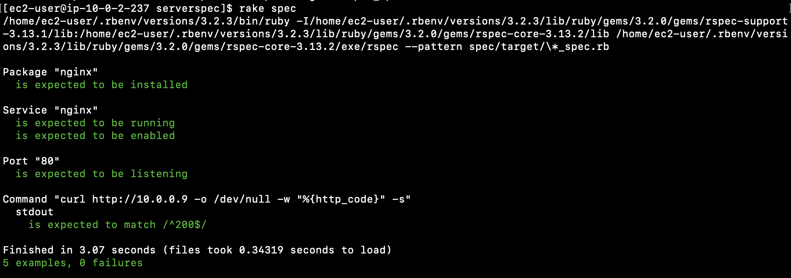

## 第 11 回課題

### 概要

Serverspec で第 5 回課題で作成した EC2 のテストを実施。テスト用 EC2 から ssh 接続でテストを実行する。

### Serverspec のインストール、セットアップ

```
gem install serverspec
mkdir serverspec
cd serverspec
serverspec-init
```

セットアップ後のテスト実行用 EC2 サーバのディレクトリ構成

```
[ec2-user@ip-10-0-2-237 ~]$ tree
.
└── serverspec
    ├── Rakefile
    └── spec
        ├── spec_helper.rb
        └── target
            └── sample_spec.rb
```

### テストファイル

[sample_spec.rb](sample_spec.rb)

### テスト実行結果



### 感想

そもそもサーバのテストができることを知らなかったため勉強になりました。  
テストにより、サーバが仕様通りの設定になっているかなどを確認できるので、ミスの防止や品質の維持ができると感じました。  
もっと色々なテストができるよう、引き続き学びたいと思います。
