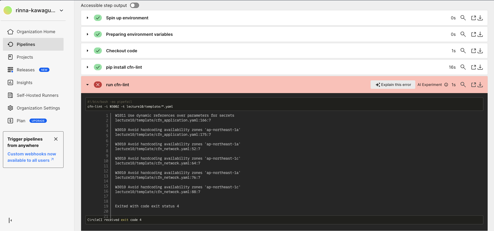
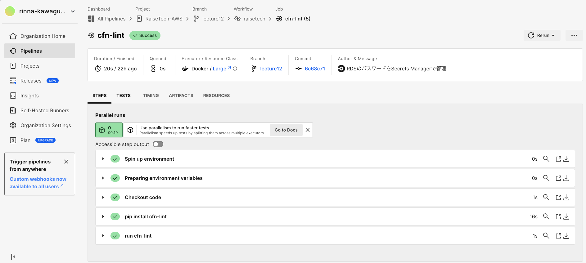

## 第 12 回課題

CirclrCI のサンプルコンフィグが正しく動作するようリポジトリに組み込む。

### 実施内容

1. 課題用のリポジトリを CircleCI と連携させる。
2. .circleci/config.yml をサンプルコンフィグの内容に書き換える。cfn-lint 対象は CloudFormation のテンプレートファイルを指定。（[書き換え後の config ファイル](../.circleci/config.yml)）
3. GitHub に push すると CircleCI が動作し、警告がでる。
4. CloudFormation のテンプレートファイルを修正する。（[修正後の CloudFormation のテンプレートファイル](../lecture10/template)）
5. 再度 GitHub に push し、警告がでないことを確認。

### テンプレート修正前の CI 結果

以下の警告がでる。

- シークレットのパラメータに対して動的参照を使用する
- AZ のハードコードを避ける

### テンプレート修正

- RDS のパスワードを Secrets Manager で管理する。
- 擬似パラメータ`AWS::Region`と組み込み関数`Fn::Select`, `Fn::GetAZs`を使用して AZ を指定する。

### テンプレート修正後の CI 結果

警告が出なくなる。

### 感想

自動で CloudFormation のテンプレートファイルをチェックしてくれ、自分では気が付かなかった修正点を知ることができて便利だと感じました。  
CI は様々な設定ができそうなので、もっと使いこなせるようになりたいです。
